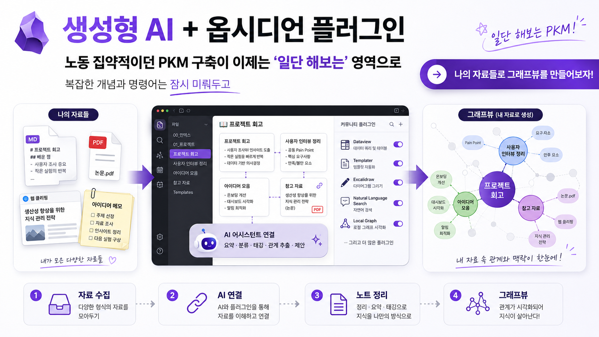

<div align="center">


# 바이브 옵시디언

**옵시디언 + 생성형 AI로 만드는 나만의 LLM Wiki**

초보자가 따라 하며 개념까지 익히는 모듈별 실습 Workbook · A부터 P까지

</div>

---

생성형 AI가 옵시디언 커뮤니티 플러그인에 연결되면서, 노동 집약적이던 PKM(개인지식관리) 구축이 **"일단 해보는"** 영역으로 바뀌었습니다. 복잡한 개념은 잠시 미뤄두고, **내가 가진 자료로 그래프 뷰부터** 만들어 봅니다. 질문할수록 자산이 쌓이는 **복리 구조**가 핵심입니다.

<div align="center">

</div>

---

## 🚀 시작하기

이 저장소는 **웹페이지 형태의 실습 교재**입니다. 두 가지 방법 중 하나로 엽니다.

**① 로컬에서 바로 보기 (가장 간단)**
저장소를 내려받은 뒤 `workbook/intro.html`을 **브라우저로 더블클릭**하면 끝입니다. (별도 설치 불필요)

```bash
git clone <이 저장소 주소>
# 내려받은 폴더의 workbook/intro.html 을 브라우저로 열기
```

**② GitHub Pages로 보기 (온라인 공유)**
저장소 **Settings → Pages → Branch: main / (root)** 로 배포하면, 루트 주소가 자동으로 소개 페이지로 연결됩니다.

> 💡 GitHub 저장소 화면에서 `.html` 링크를 직접 클릭하면 소스코드만 보입니다. **실제 화면**은 위 ① 또는 ②로 열어야 합니다.

---

## 📚 입문 과정 — A부터 순서대로 따라하세요

아래 순서를 **그대로** 따라가면 됩니다. 각 모듈은 〈목표 → 개념 → 따라하기 → 막힘 해결 → 퀴즈 → 산출물〉 6단 구조이고, 체크박스 진행 상태는 브라우저에 자동 저장됩니다.

| 순서 | 모듈 | 무엇을 하나 | 소요 |
|:---:|------|------------|:---:|
| **A** | [사전 준비물](workbook/A_사전준비물.html) | 실습 환경 요건 점검·계정 준비 | 15분 |
| **B** | [설치](workbook/B_설치.html) | Node.js → 코덱스 CLI → 옵시디언 → Claudian 플러그인 | 90~120분 |
| **C** | [Vault 생성](workbook/C_Vault생성.html) | 첫 보관소(Vault) 만들기 | 15분 |
| **D** | [온보딩](workbook/D_온보딩.html) | 스타터킷·스킬·파일 변환 파이프라인 설치 | 70~90분 |
| **E** | [자료 등록 — Ingest](workbook/E_Ingest.html) | 자료 1건을 의미 단위로 분할해 위키로 | 50분 |
| **F** | [질문과 답변 — Query](workbook/F_Query.html) | 질문하고, 가치 있는 답변을 다시 자산으로 | 50분 |
| **G** | [개념 정리](workbook/G_개념정리.html) | LLM Wiki vs RAG·NotebookLM 원리 구분 | 40분 |
| **H** | [산출물 문서 흐름](workbook/H_산출물문서.html) | 위키 자산으로 PCD 초안 만들기 | 60분 |

> **진행 원칙** — ① 일단 해본다 ② 강사와 동일 환경 ③ 막히면 클로디안에게 자연어로 물어본다.

---

## 🧭 후속 과정 — I부터 P (심화)

입문 A~H를 마친 뒤 진행합니다.

| 순서 | 모듈 | 한 줄 |
|:---:|------|------|
| **I** | [GraphRAG](workbook/I_GraphRAG.html) | 노트 간 '관계 이름'이 답의 품질을 바꾼다 |
| **J** | [세밀화](workbook/J_세밀화.html) | 위키는 정제를 반복한다 |
| **K** | [Vault 공유](workbook/K_Vault공유.html) | 혼자에서 팀으로 |
| **L** | [Index](workbook/L_Index용어집.html) | 용어집과 색인 |
| **M** | [그래프 Join](workbook/M_그래프Join.html) | Vault와 Vault를 결합 |
| **N** | [인사이트 View](workbook/N_인사이트View.html) | 연결의 공통분모에서 새 통찰 |
| **O** | [프레임워크 + Obsidian](workbook/O_프레임워크종합.html) | 산출물 × 프레임워크 종합 |
| **P** | [자동화](workbook/P_agentauto.html) | 스케줄로 볼트가 스스로 자란다 |

---

## 🧰 참고 자료

- 📦 **[스타터킷 안내](workbook/스타터킷.html)** — 폴더 구조·규칙·명령어(`/ingest`, `/query`) 시작 패키지 + 설치법
- 📖 **[용어집](workbook/용어집.html)** — 강의에 등장하는 모든 용어를 검색·분류 (73개)
- 🏠 **[소개 페이지](workbook/intro.html)** — 왜 지금 바이브 옵시디언인가

---

## 📦 스타터킷

[`StarterKit/`](StarterKit/) 는 옵시디언 Vault에 바로 적용하는 시작 패키지입니다.

```
StarterKit/
├─ CLAUDE.md / AGENTS.md          # 볼트 운영 규칙(클로드·코덱스용, 내용 동일)
├─ README.md                      # 설치·온보딩 안내
├─ 00_Setup/commands/             # /ingest, /query 명령 원본 (온보딩 때 자동 설치)
├─ 10_Inbox/                      # 자료 입장 (직접 손대는 유일한 폴더)
├─ 20_Raw/                        # 메타데이터 장착 후 영구 보관
├─ 30_Wiki/ (Concept·Entity·Guide·MOC)   # 의미 단위로 분해된 지식 노트
├─ 40_Query/                      # 질문·답변 기록
└─ 50_Output/                     # 최종 산출물(PCD·MRD·보고서)
```

**파일 처리 흐름**: `10_Inbox → 20_Raw → 30_Wiki → 40_Query → 50_Output`
**핵심 규칙**: 인박스에 넣는 것까지만 내 손으로 · Raw 수정·삭제 금지 · 위키 안에서만 답변 · 승격은 사람이 확인.

---

## 🗂️ 저장소 구조

```
.
├─ index.html          # 루트 진입 → workbook/intro.html 자동 이동 (GitHub Pages용)
├─ README.md
├─ workbook/           # 실습 Workbook (웹페이지) ← 여기가 본체
│   ├─ intro.html      #   소개 (시작점)
│   ├─ index.html      #   전체 목차
│   ├─ A_사전준비물.html … P_agentauto.html
│   ├─ 용어집.html / 스타터킷.html
│   └─ *.png           #   페이지 이미지
├─ StarterKit/         # 옵시디언 Vault 스타터킷
└─ docs/               # 설계 문서·커리큘럼·작업로그
    ├─ design.md
    ├─ 옵시디언_LLM_Wiki_강의_커리큘럼.md / .html
    └─ 작업로그_바이브옵시디언_Workbook.md
```

---

<div align="center">
<sub>옵시디언 기반 LLM Wiki · PKM · RAG 실습형 강의 Workbook</sub>
</div>
